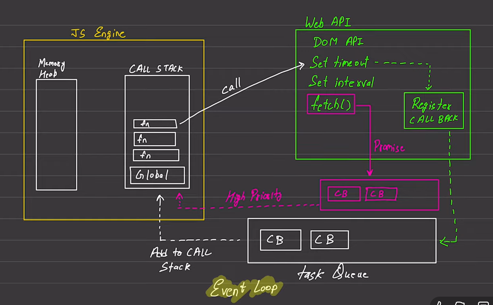

# JavaScript

**Synchronous →** Ek code execute hoga then second code execute hoga —  
means that JavaScript executes code **one line at a time**.  
**Single Thread**

**Ye above waale features default JavaScript ke hai.**

---

**Execution Context — Single threaded (Line by Line)**  
**Call Stack - Memory Heap**

---

### Blocking Code vs Non-Blocking Code

**Blocking Code** — blocks the flow of program → *Read file Sync*  
**Non-Blocking Code** — does not block execution → *Read file Async*

---

