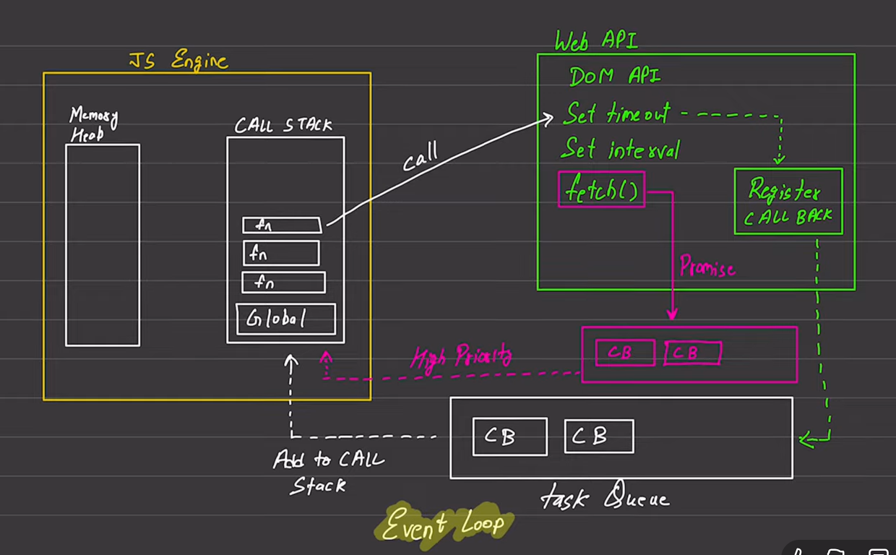

# Javascript...

** Synchronous -> Ek code execute hoga then second code execute hoga...mean that JavaScript executes code one line at a time**
** Single Thread..**

** Ye above waale features Default javascript ke hai...**

**Execution Context -- Single threaded (Line by Line) **
** Call Stack - Memory Heap**

### Blocking Code Vs Non Blocking Code
** Blocking code - blocks the flow of program -> Read file Sync..**
** Non Blocking Code - Does not block execution... -> Read file Async**

